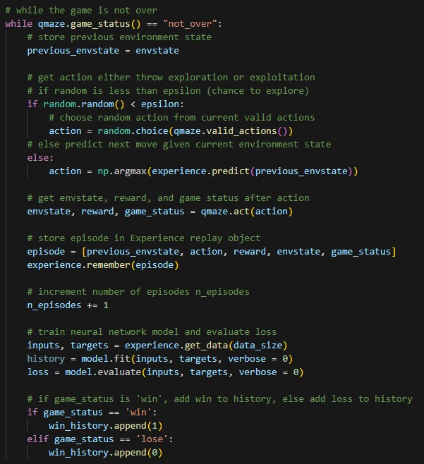
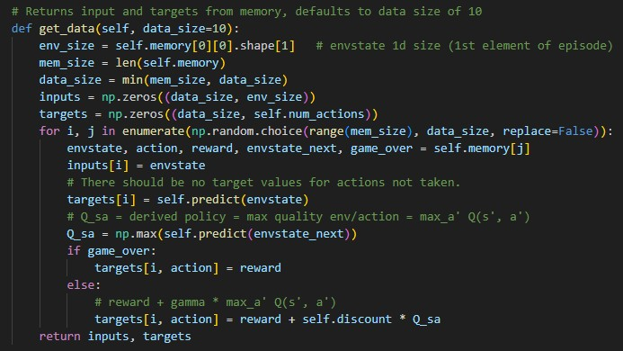
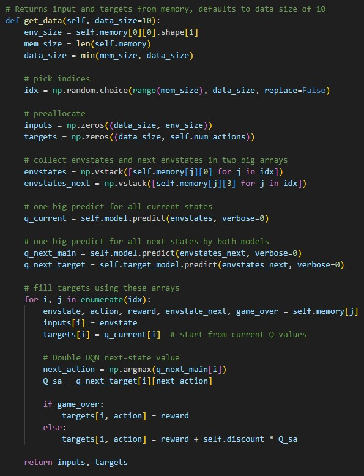
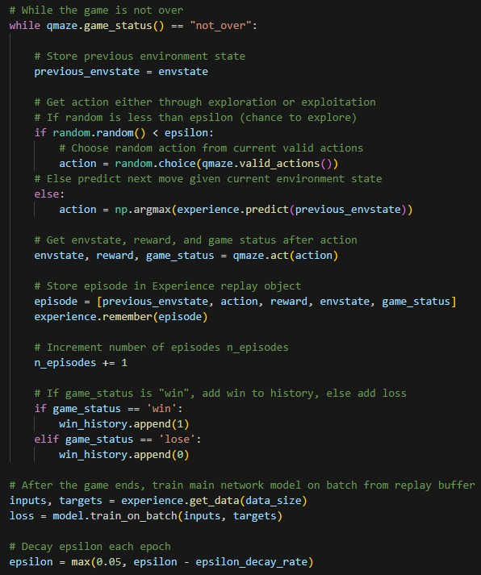
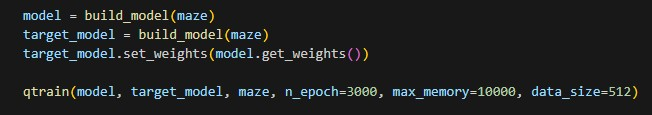

The artifact I chose for this enhancement is a Treasure Maze Game intelligent agent. I created this artifact in August 2025 as part of the course CS 370 Current/Emerging trends. I chose this artifact for the Algorithms and Data Structures portion of my ePortfolio because it demonstrates the advanced algorithms required to train an intelligent agent with Deep Q-Learning. This algorithm, as well as a few different data structures, come together to create an intelligent agent that is able to learn how to solve a maze. This artifact consists of three files: once for establishing the environment; one for managing the agent’s experience; and one for configuring the maze, agent, and network parameters as well as the Deep Q-Learning algorithm itself.

> 
> 
> Original Deep Q-Network training loop.
> 

> Original GameExperience object.
> 

My planned enhancements to this artifact were implementing epsilon decay and expanding the DQN to a Double Deep Q-Learning algorithm. Implementing both of these enhancements demonstrates my ability to evaluate a solution and determine what improvements can be made. They are more advanced AI training techniques that are meant to increase the efficiency of training and the strength of the resulting agent. After starting work on the enhancement, I realized that more changes were needed. The original artifact was created on a remote VM. When I tried running the code on my own computer, it was taking orders of magnitude longer to complete than it was on the remote computer. If I was going to get the code to run and successfully train the agent, I was going to need to make more changes. I increased the data and max memory sizes to better take advantage of my GPU. I changed the training process to train a batch of experiences once per epoch instead of training every episode of every epoch. I changed the “GameExperience” object to create a batch of predictions by each model once per “get_data” call instead of a separate predict call for each state.

> Enhanced GameExperience object. Now only performs two batch predictions each time "get_data" is called.
> 

Finally, I reduced the number of print calls to only print epoch information once every 10 epochs. All these changes were meant to reduce the amount of Python overhead and number of separate GPU calls made to better utilize and dramatically speed up the training process on my hardware. The hardware and code changes mean an apples-to-apples comparison between the original agent and the new agent are not fair, so it is difficult to know exactly how impactful my original planned enhancements are to the original agent. With all those factors being considered, I was able to bring the training time per epoch on my computer down from several minutes to a couple seconds at most. I think these additional changes demonstrate my problem-solving skill and learning in regard to algorithms as they relate to artificial intelligence.

> Initialize both models for the DDQN and start training
> 

> Enhanced Double Deep Q-Network training loop. Training is removed from the loop so training only happens once per epoch.
> 

I learned a lot about optimizing an algorithm while enhancing this artifact. I was expecting to be able to modify the DQN to a Double DQN and implement exploration decay with relative ease. I ended up needing to put a lot of work into getting the code to run at any sort of reasonable speed on my computer, and I think this ultimately resulted in a much stronger enhancement as it displays considerably more learning than my original plans did.
