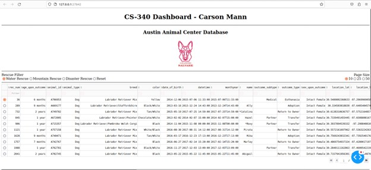
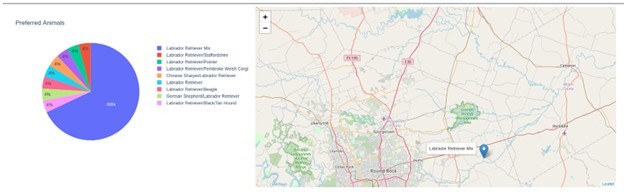
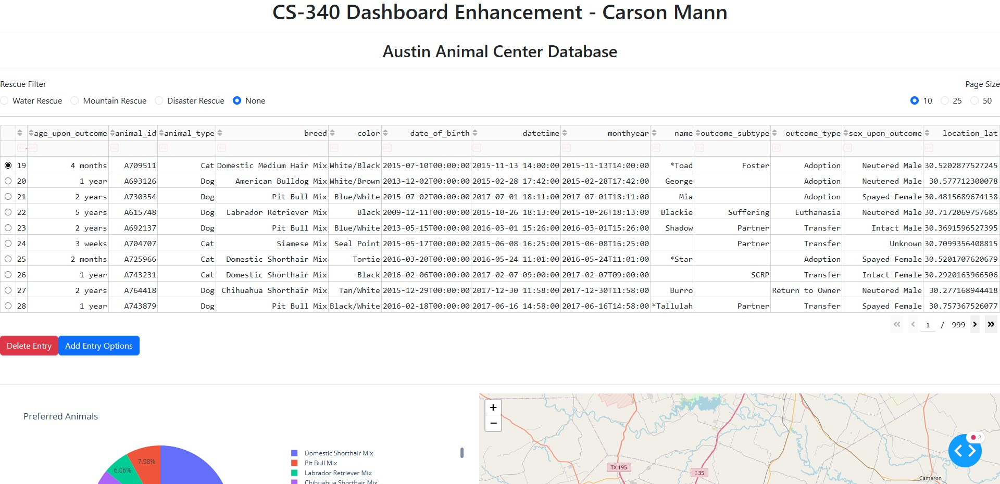
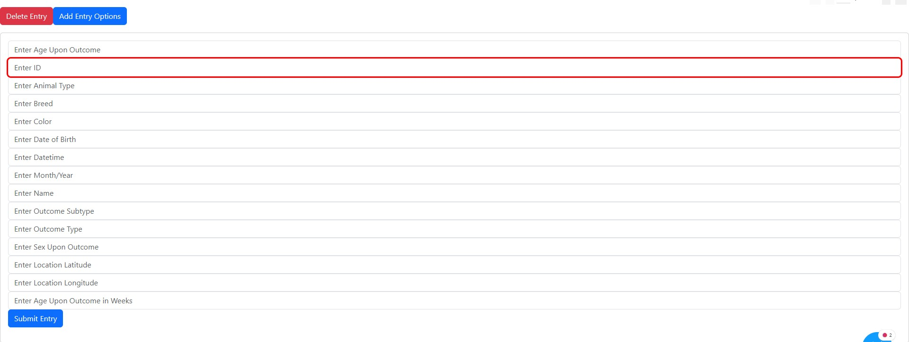

The artifact I chose for this enhancement is a Python CRUD module and web dashboard that interface with an animal rescue shelter database. I created this artifact in June 2025 as part of the course CS 340 Client/Server Development. I chose this artifact for the Databases portion of my ePortfolio because it demonstrates the creation of a database and a system with a user interface that allows for easy interaction with the database. This artifact has three main parts: the MongoDB database, the Python CRUD module, and the Python dashboard.

> 
> 
> 
> Original Dashboard

My planned enhancements to this artifact were centered on the dashboard, adding the ability for the user to create and delete entries in the database from the dashboard. Without these enhancements, users can only read data from the database. If they want to modify the database in any way, they need direct access to the server the database is on. Since these functions were already implemented in the CRUD module, the only work that was needed was adding the buttons and text inputs to the dashboard app layout and creating the callbacks for creating and deleting entries in the database. These enhancements demonstrate my ability to analyze an existing solution and rework it with consumer-facing design in mind to create a more functional and accessible solution to end-users.

> 
>
> The enhanced dashboard has more functionality and is visually more appealing.

After starting the enhancement, I realized that I could do more work to make the dashboard more visually appealing and not clutter the interface with my new additions. I decided to swap from dash core components to dash bootstrap components. This allowed me to implement the dbc stylesheet and a collapsible form that contains the input fields for creating a database entry.

> 
>
> Added a collapsible input form that allows for creating an entry in the database.

These additions make the dashboard much more visually appealing and prevent the many input fields from taking up space on the screen in its default state. I think this reinforces my initial goals of consumer-oriented and accessible systems design while still implementing the additional database functionality. A challenge I faced in enhancing this artifact was getting my environment set up correctly. I did not know the original versions of every module used in the virtual machine in CS 340. When I was setting up my environment, I ran into issues where certain functions had been deprecated or changed in the versions I was using. This required additional work to find versions that allowed me to use the functions I was trying to without making sweeping changes to how the dashboard worked. I learned more about how Dash works and how to create better callbacks than I had initially created in the original artifact.

Original Artifact 3 Code: [link](https://github.com/PoundOfCheese/CS-499-ePortfolio/tree/main/original_artifact_3)

Enhancement 3 Code: [link](https://github.com/PoundOfCheese/CS-499-ePortfolio/tree/main/enhancement_3)
