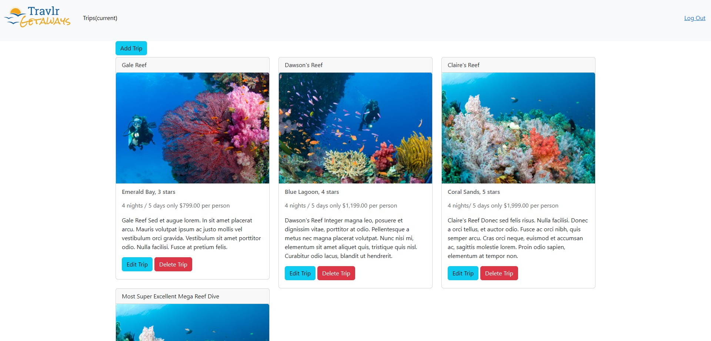

## Professional Self-Assessment
> Lorem ipsum dolor sit amet, consectetur adipiscing elit. Nam nec lobortis arcu, non facilisis leo. Phasellus quis dictum magna. Morbi id eros suscipit, pulvinar massa non, eleifend sapien. Morbi sed eros sollicitudin, placerat augue quis, ornare velit. Nam cursus accumsan dolor, in aliquam tellus imperdiet a. Vivamus cursus, nibh quis efficitur facilisis, eros erat feugiat tortor, nec laoreet justo ante sit amet leo. Duis imperdiet finibus imperdiet. Fusce a tortor tellus. Sed luctus aliquet lacus, eget feugiat felis pellentesque at. Praesent nec scelerisque nunc. Etiam blandit dolor vel orci egestas ultrices. Suspendisse potenti. Vivamus interdum enim ex, in tincidunt orci posuere ac.

## Code Review


## Software Design and Engineering Enhancement
> This artifact is a Full Stack Web Application created for CS 465 Full Stack Development 1.
> 
> 
> Enhancement 1 breakdown: [link](enhancement_1.md)

## Algorithms and Data Structures Enhancement
> Lorem ipsum dolor sit amet, consectetur adipiscing elit. Nam nec lobortis arcu, non facilisis leo. Phasellus quis dictum magna. Morbi id eros suscipit, pulvinar massa non, eleifend sapien. Morbi sed eros sollicitudin, placerat augue quis, ornare velit. Nam cursus accumsan dolor, in aliquam tellus imperdiet a. Vivamus cursus, nibh quis efficitur facilisis, eros erat feugiat tortor, nec laoreet justo ante sit amet leo. Duis imperdiet finibus imperdiet. Fusce a tortor tellus. Sed luctus aliquet lacus, eget feugiat felis pellentesque at. Praesent nec scelerisque nunc. Etiam blandit dolor vel orci egestas ultrices. Suspendisse potenti. Vivamus interdum enim ex, in tincidunt orci posuere ac.

## Databases Enhancement
> Lorem ipsum dolor sit amet, consectetur adipiscing elit. Nam nec lobortis arcu, non facilisis leo. Phasellus quis dictum magna. Morbi id eros suscipit, pulvinar massa non, eleifend sapien. Morbi sed eros sollicitudin, placerat augue quis, ornare velit. Nam cursus accumsan dolor, in aliquam tellus imperdiet a. Vivamus cursus, nibh quis efficitur facilisis, eros erat feugiat tortor, nec laoreet justo ante sit amet leo. Duis imperdiet finibus imperdiet. Fusce a tortor tellus. Sed luctus aliquet lacus, eget feugiat felis pellentesque at. Praesent nec scelerisque nunc. Etiam blandit dolor vel orci egestas ultrices. Suspendisse potenti. Vivamus interdum enim ex, in tincidunt orci posuere ac.
> 
> 
